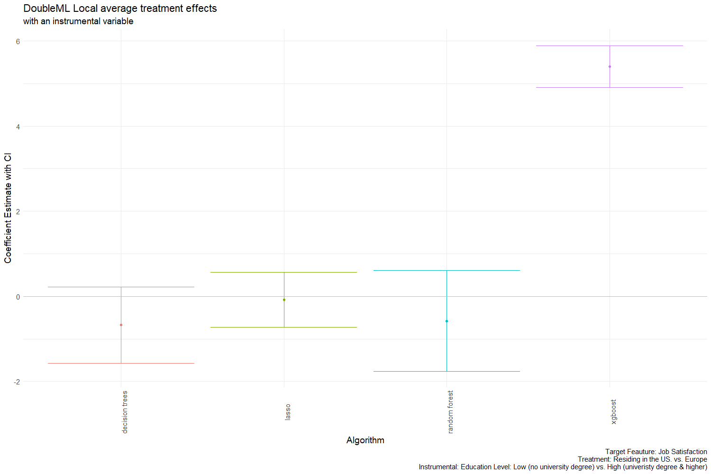
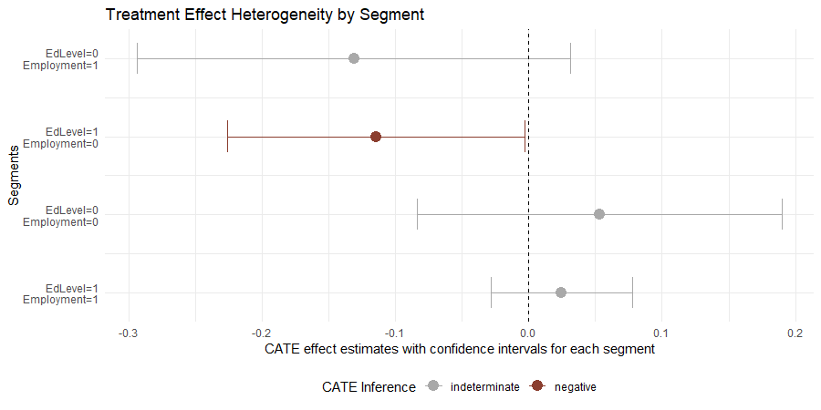

## Causal ML

The project utilizes various causal modeling techniques to determine if living in the U.S. or Europe impacts developers’ overall job satisfaction. The methodological approach, involving double ML, causal segmentation, and Bayesian networks, is deliberately inductive, allowing the different models to uncover distinct insights.

See the relevant blog post available at [https://mmuratardag.github.io/blog_posts/so_ai_developer_causal.html](https://mmuratardag.github.io/blog_posts/so_ai_developer_causal.html)

Snapshot of the findings:

- Geography matters to a certain extent: there are minor differences in job satisfaction between the U.S. and Europe—but there is a twist for highly educated, unemployed European developers.

- Years of coding experience can nudge your outlook on AI: U.S. developers barely link it to job satisfaction, while European developers with more experience tend to be more cautious.

- AI usage and ethics: In the U.S., concern about AI ethics leads to lower confidence in AI handling complex tasks. In Europe, that relationship is flipped—confidence in AI handling complex tasks reduces ethical concerns.

    
    

